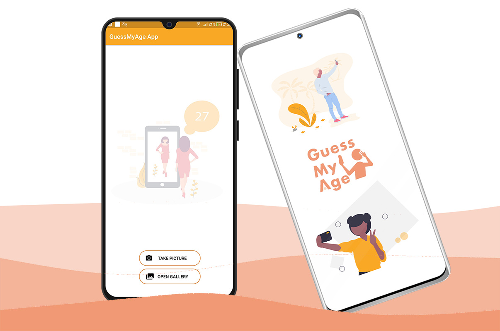
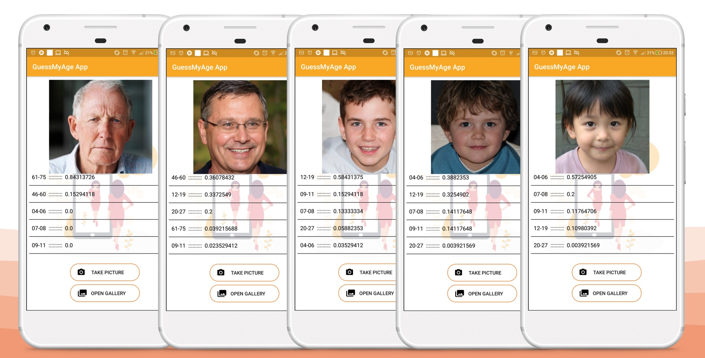
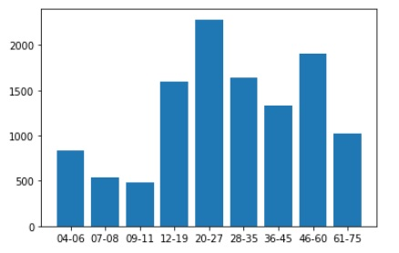
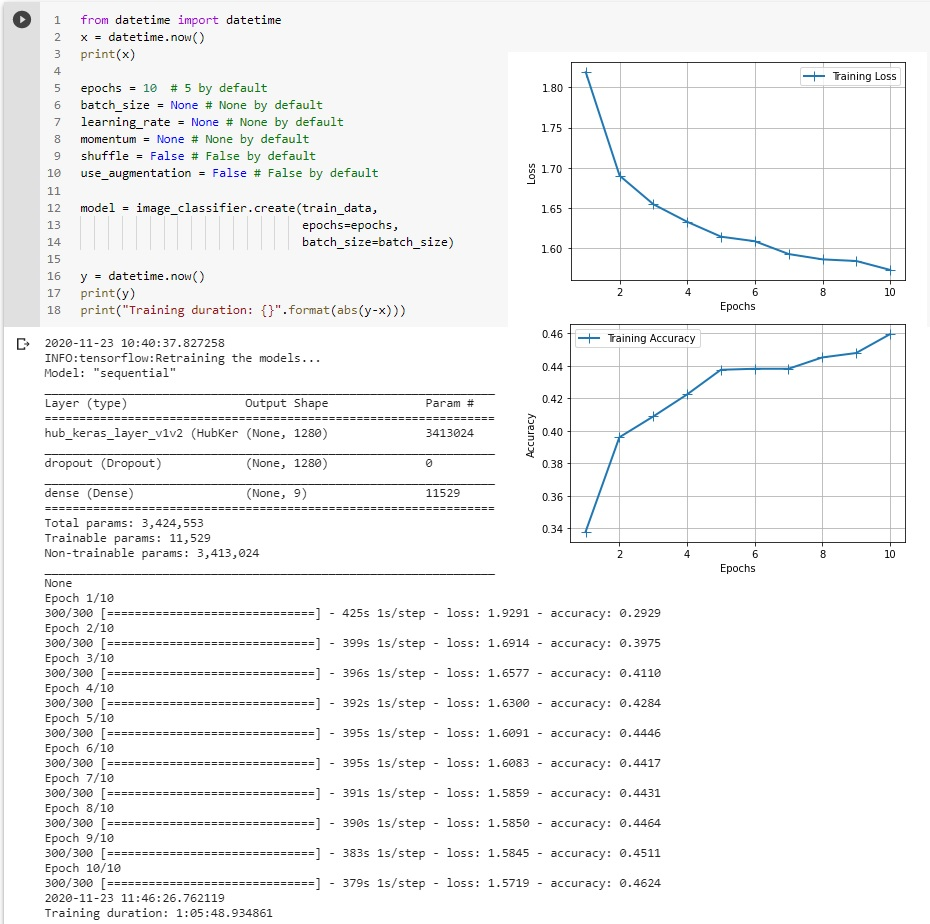
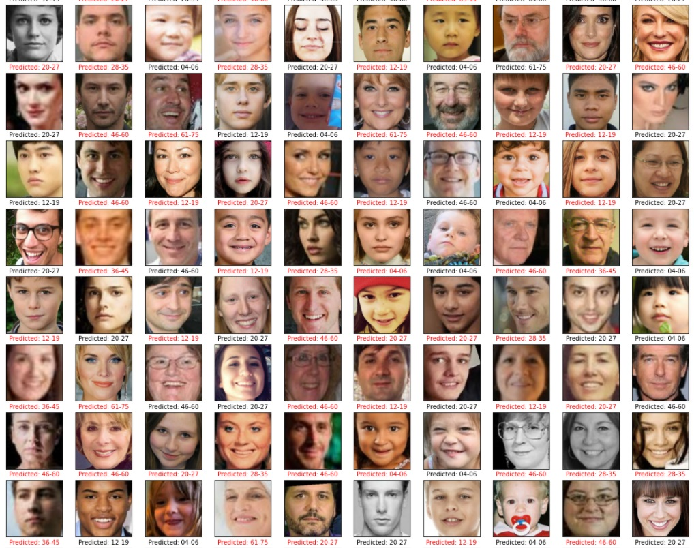
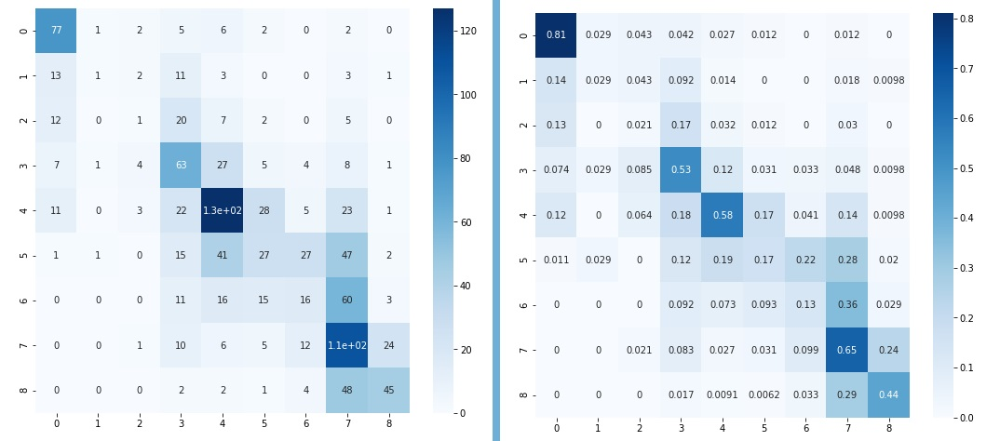

# Age Classification App

Age Classification App using Native Android. The quantized `.tflite` model was trained and generated using [TensorFlow Lite Model Maker](https://www.tensorflow.org/lite/tutorials/model_maker_image_classification). 

Face databases used: [UTKFace](https://susanqq.github.io/UTKFace/) combined with [Appa-Real](http://chalearnlap.cvc.uab.es/dataset/26/description/).



## Contents

- [Screenshots](#screenshots)
- [Setting up and Running the Android project](#setting-up-and-running-the-android-project)
- [Android Dependencies and Versions used](#android-dependencies-and-versions-used)
- [Model description](#model-description)
- [Credits and Resources used](#credits-and-resources-used)
- [License](#license)

## Screenshots



Face images generated from [ThisPersonDoesNotExist](https://thispersondoesnotexist.com/).

## Setting up and Running the Android project

- Download and install [Android Studio](https://developer.android.com/studio#downloads)
- Clone this repository

```
git clone https://github.com/radualexandrub/Android-Age-Classification.git
```

- Search (within Windows Explorer) and Delete all `.iml` files within the project folder. [This will solve `Unsupported Modules Detected:` Error](https://stackoverflow.com/questions/28668252/android-studio-error-unsupported-modules-detected-compilation-is-not-supported)
- Open Android Studio and click on `Import Project (Gradle, Eclipse ADT, etc.)` (Do **not** click on `Open an Existing Project`)
- Wait for Gradle to set up all the required packages
- If Error [`Gradle sync failed: Module: 'app' platform 'android-29' not found.`](https://stackoverflow.com/questions/60681045/error-module-app-platform-android-28-not-found-and-design-editor-is-unava) is encountered, go to `File -> Settings -> System Settings -> Android SDK -> Check Android 10.0` and hit `Apply`. After installation, click on `File -> Sync Project with Gradle files` and wait for it's setup.
- Click on `Run 'app' (Shift+F10)`
- If Error [`Unable to delete file`](https://stackoverflow.com/questions/47312169/android-studio-3-0-unable-to-delete-file/47312259) is encountered, just go to the specified directory and delete the file manually. Re-run the project.

**Note:** You can install the application directly on your Android Device via the provided `.apk` file from this repository.

## Android Dependencies and Versions used

```
Android Studio 4.1.1
Build #AI-201.8743.12.41.6953283, built on November 5, 2020
Runtime version: 1.8.0_242-release-1644-b01 amd64
VM: OpenJDK 64-Bit Server VM by JetBrains s.r.o
```

From `build.gradle (app)`

```yaml
android {
    compileSdkVersion 29
    defaultConfig {
        applicationId "com.radu.GuessMyAge"
        minSdkVersion 23
        targetSdkVersion 29
        versionCode 1
        versionName "1.0"
        testInstrumentationRunner "androidx.test.runner.AndroidJUnitRunner"
    }
}

dependencies {
	implementation fileTree(dir: 'libs', include: ['*.jar'])
    implementation 'androidx.appcompat:appcompat:1.1.0'
    implementation 'androidx.constraintlayout:constraintlayout:1.1.3'

    implementation('org.tensorflow:tensorflow-lite:0.0.0-nightly') { changing = true }
    implementation('org.tensorflow:tensorflow-lite-gpu:0.0.0-nightly') { changing = true }
    implementation('org.tensorflow:tensorflow-lite-support:0.0.0-nightly') { changing = true }

    testImplementation 'junit:junit:4.12'
    androidTestImplementation 'androidx.test:runner:1.2.0'
    androidTestImplementation 'androidx.test.espresso:espresso-core:3.2.0'
}
```

## Model description

Classes used (based on [The 12 Stages of Life](https://www.institute4learning.com/resources/articles/the-12-stages-of-life/) article):

- 04 - 06 years old - _early childhood_
- 07 - 08 years old - _middle childhood_
- 09 - 11 years old - _late childhood_
- 12 - 19 years old - _adolescence_
- 20 - 27 years old - _early adulthood_
- 28 - 35 years old - _middle adulthood_
- 36 - 45 years old - _midlife_
- 46 - 60 years old - _mature adulthood_
- 61 - 75 years old - _late adulthood_

**The model was trained with the default parameters of`image_classifier` from `tflite_model_maker` library.**

```
INFO:tensorflow:Load image with size: 10674, num_label: 9, labels: 04-06, 07-08, 09-11, 12-19, 20-27, 28-35, 36-45, 46-60, 61-75.
```

Classes distribution by number of images (10 674 in total):



Model training:



Model evaluation:

```
loss, accuracy = model.evaluate(test_data)
34/34 [==============================] - 46s 1s/step - loss: 1.6116 - accuracy: 0.4373
```



Confusion Matrix:



**NOTE:** A small dataset of 4784 images from UTKFace was provided so you can run the `AgeData.ipynb` notebook and train the model yourself. This small dataset can be found in this repository in `age_data_small.zip` (~25MB). You can run the notebook using [Google Colab](https://colab.research.google.com/), while uploading the `.zip` to your Google Drive account.

## Credits and Resources used

- [UTKFace Database with age, gender, and ethnicity annotations](https://susanqq.github.io/UTKFace/)
- [APPA-REAL Database that contains 7,591 images with associated real and apparent age labels](http://chalearnlap.cvc.uab.es/dataset/26/description/)
- [TensorFlow Lite Model Maker Library](https://www.tensorflow.org/lite/tutorials/model_maker_image_classification)
- [Pre-made image classification App using Tensorflow Lite](https://blog.notyouraveragedev.in/android/image-classification-in-android-using-tensor-flow/)
- [Access camera and media storage on Android (Java)](https://guides.codepath.com/android/Accessing-the-Camera-and-Stored-Media)
- Design:
  - [MockUPhone - Screenshot to Device mockup generator](https://mockuphone.com/)
  - [Beautiful Wave Generator](https://svgwave.in/)
  - [Beautiful images of source code using Carbon](https://carbon.now.sh/)
  - [Free amazing illustrations by unDraw](https://undraw.co/illustrations)

## License

Released under the [MIT License](./LICENSE).
